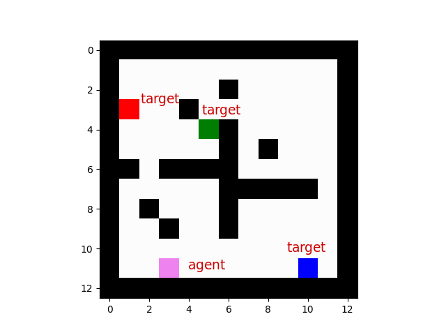

The "Four Rooms" scenario is a classic reinforcement learning problem. A simple environment is used to illustrate and test different algorithms, where an agent (like a robot) must navigate a grid-like space with four distinct rooms to reach a goal state. This must be done while avoiding obstacles.

This project uses a greedy algorithm to solve different four room scenarios. The agent can move up, down, left and right. Each action the agent takes assigns a reward to the destination cell. It then learns to take the best action by following the path with the highest reward. The AI agent is represented in pink while the different targets are coloured red, green and blue.

Each scenario can be run directly with `python <file name>` or within a virtual environment using Make

## Scenario 1 - Single Target

Evaluates the best path to a single target location from the agent starting position.
Direct: `python single.py`
VENV : `make scenario1`

## Scenario 2 - Multi Target

Three target locations are placed. The agent must find all three locations before terminating.
Direct: `python multi.py`
VENV : `make scenario2`

## Scenario 3 - Ordered Targets

Requires the agent to pass through the three target locations in a specific order (red -> green -> blue).
Direct: `python ordered.py`
VENV : `make scenario3`